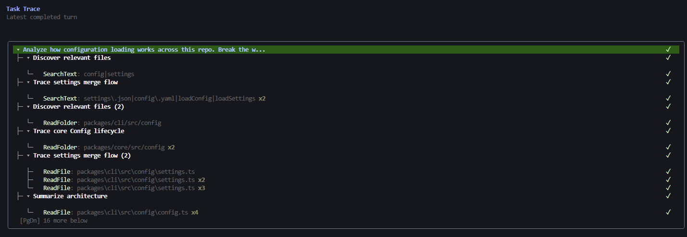
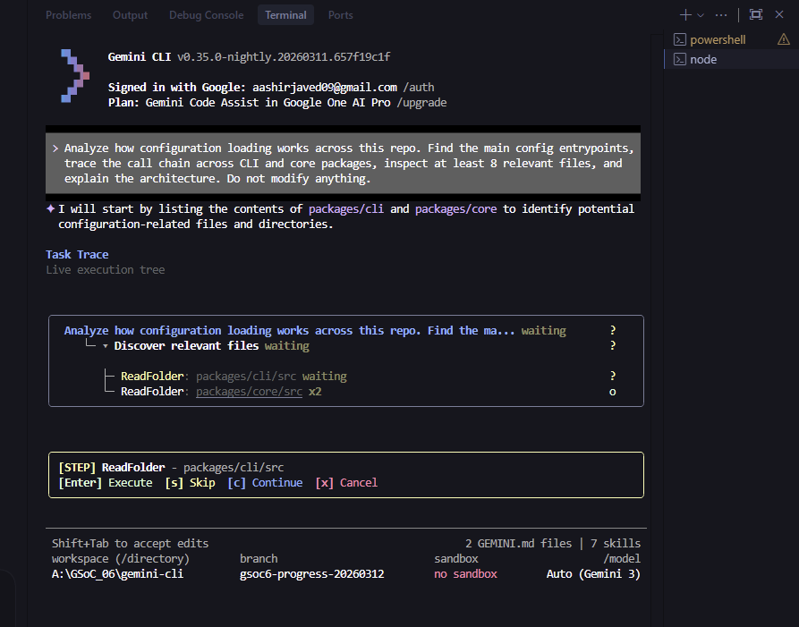
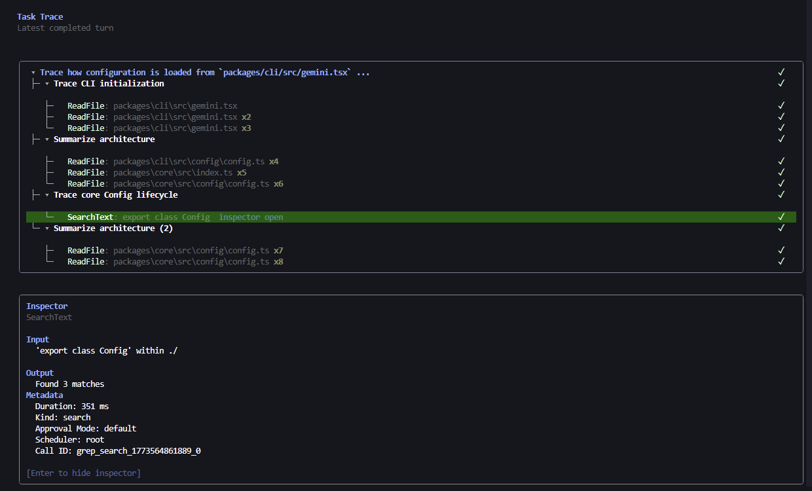
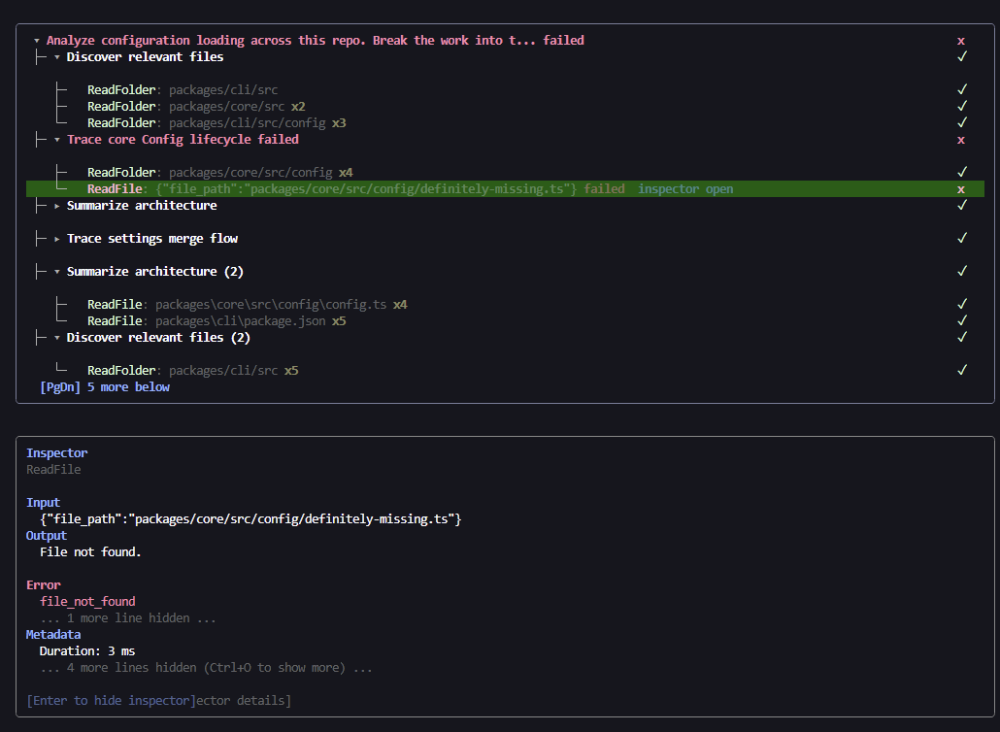
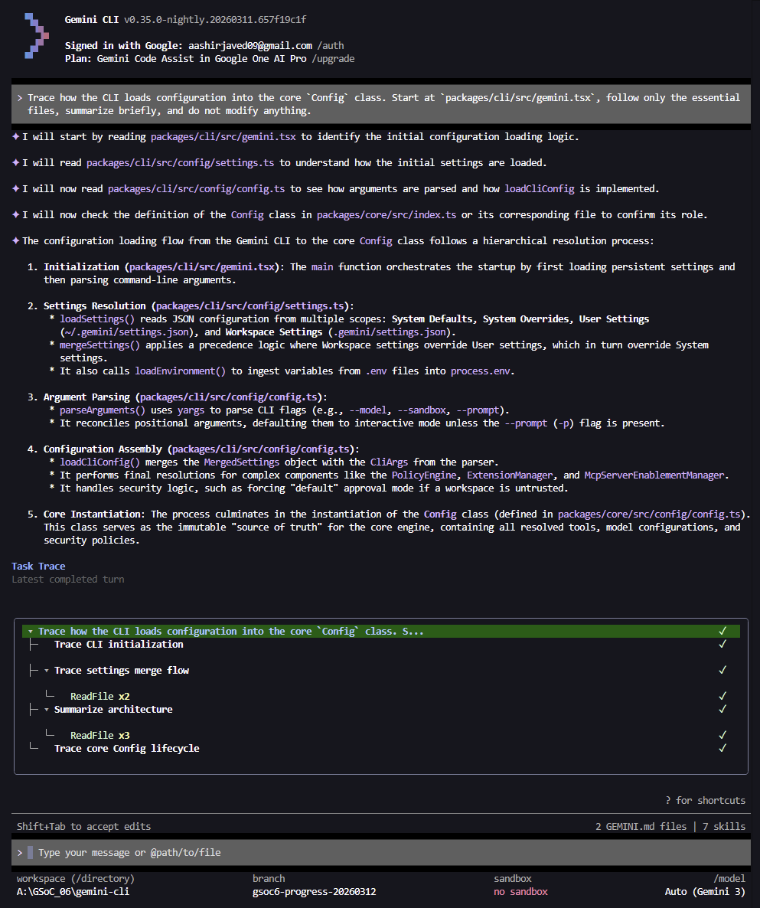
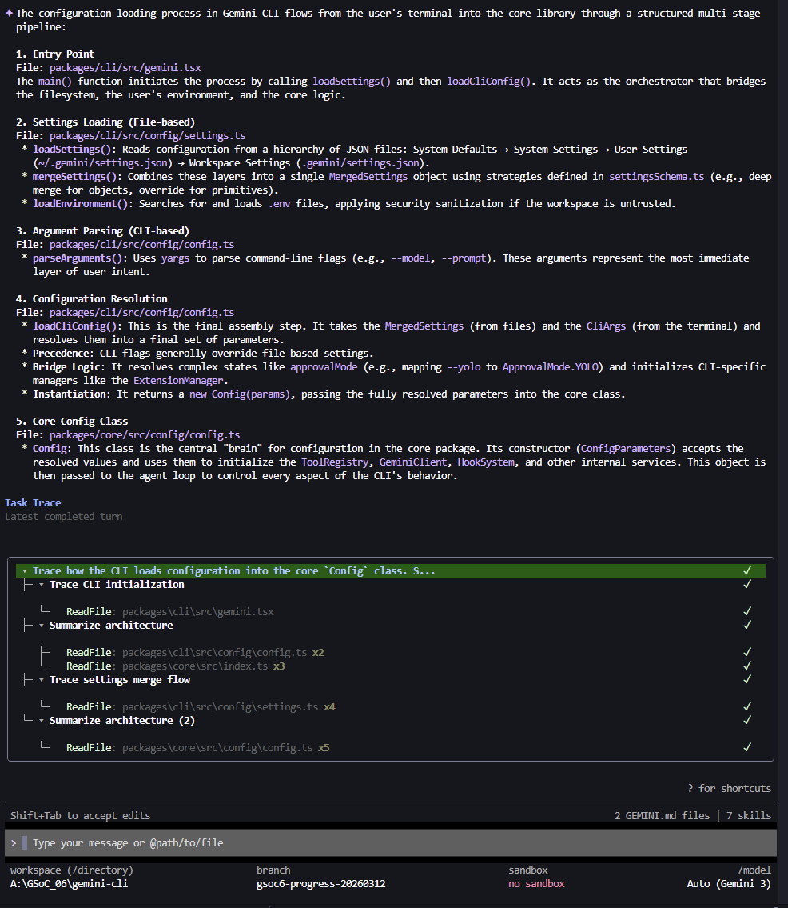
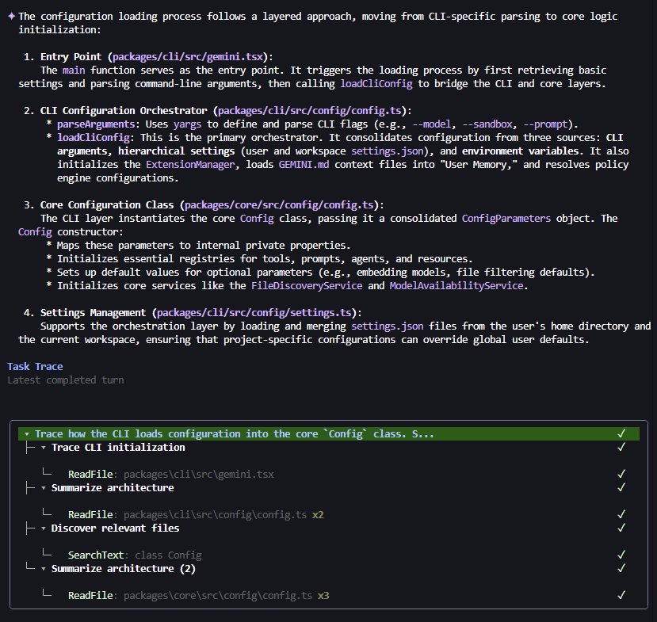
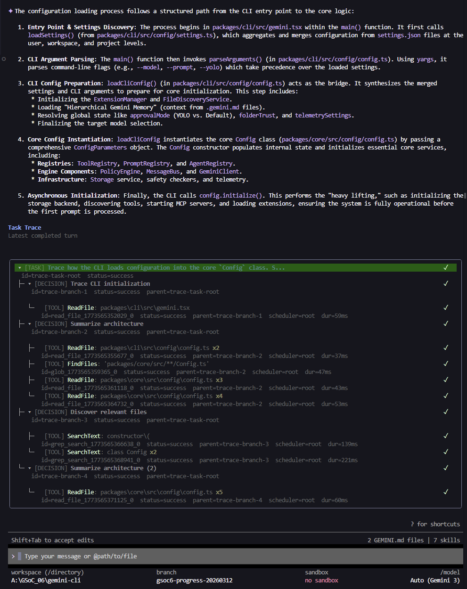

# GSoC 2026 PoC Branch: Interactive Progress Visualization & Task Stepping

Branch: `gsoc6-progress-20260312`

I built this branch as a proof-of-concept for **GSoC 2026 Idea 6: Interactive
Progress Visualization & Task Stepping** in Gemini CLI.

My goal here was not to present a finished product. The goal was to take the
idea seriously enough to prototype it inside the real Gemini CLI codebase,
validate the interaction model in the existing Ink UI, and show what this
direction could look like if it were developed further through GSoC.

At a high level, I wanted to make Gemini CLI runs feel less like a black box and
more like a debugger-style terminal experience. In this branch, I focused on
making execution easier to follow, easier to inspect, and easier to control.

## What This Prototype Demonstrates

This branch is my attempt to cover the five expected outcomes from the project
idea in a concrete, runnable way:

- **Real-time task tree visualization** The CLI renders a live execution tree
  while a task is still running instead of showing only a flat stream of tool
  activity.

- **Step-through execution** The user can pause on actions and explicitly
  continue through the run instead of letting everything happen without
  intervention.

- **Richer node inspection** A selected trace node can expose structured details
  such as input, output, metadata, and truncated sections through an inspector
  view.

- **Nested failure visibility** Failures stay attached to the branch that owns
  them so they are easier to understand in context.

- **Verbosity controls** The trace can be rendered at different detail levels,
  including category-specific overrides for different node types.

I do not want to overstate the maturity of this branch. This is a serious
prototype, not a finished upstream feature set.

## Running The Branch

If someone wants to try this branch locally, the simplest path is to clone my
fork directly onto the GSoC branch:

```bash
git clone --branch gsoc6-progress-20260312 --single-branch https://github.com/Aaxhirrr/gemini-cli.git
cd gemini-cli
npm install
npm run build --workspace @google/gemini-cli
npm run start -- --help
```

If you already have a local checkout, you can fetch the branch instead:

```bash
git remote add aaxhirrr https://github.com/Aaxhirrr/gemini-cli.git
git fetch aaxhirrr gsoc6-progress-20260312
git checkout -b gsoc6-progress-20260312 aaxhirrr/gsoc6-progress-20260312
npm install
npm run build --workspace @google/gemini-cli
```

In my local setup, the repository-local command path was the reliable one:

```bash
npm run start -- ...
```

A global `gemini` install can fail if it points at a broken or stale bundle, so
I recommend using the local start command for this branch.

## Demo Guide

I kept the demo guide short on purpose. These are the commands and prompts I
used to validate each expected outcome.

### Demo 1: Live Task Tree

Command:

```bash
npm run start
```

Prompt:

```text
Explain how config flows from `packages/cli/src/gemini.tsx` to `packages/cli/src/config/config.ts` and then into `packages/core/src/config/config.ts`. Read only what is necessary and do not modify anything.
```

### Demo 2: Step-Through Mode

Command:

```bash
npm run start -- --step
```

Prompt:

```text
Analyze configuration loading in this repo. Trace the CLI path, core config path, and settings schema. Do not modify anything.
```

### Demo 3: Inspector

Command:

```bash
npm run start -- --trace-inspector
```

Prompt:

```text
Analyze configuration loading in this repo. Trace the CLI path, core config path, and settings schema. Do not modify anything.
```

### Demo 4: Nested Failure Path

Command:

```bash
npm run start
```

Prompt:

```text
Analyze configuration loading across this repo. Break the work into three branches: trace the CLI config entrypoints, trace the core config lifecycle, and inspect `packages/core/src/config/definitely-missing.ts` for `class Config`. Use that missing path exactly as written. Do not correct it. Treat that failure as non-fatal and continue the other branches. Do not modify anything.
```

### Demo 5: Verbosity Comparison

Commands:

```bash
npm run start -- --trace-verbosity quiet
npm run start -- --trace-verbosity standard
npm run start -- --trace-verbosity verbose
npm run start -- --trace-verbosity debug
```

Prompt:

```text
Trace the configuration startup path from `packages/cli/src/gemini.tsx` into `packages/cli/src/config/config.ts` and `packages/core/src/config/config.ts`. Read only 4-6 essential files, summarize the flow briefly, and do not modify anything.
```

If someone wants to explore the CLI flags directly, the local help output
includes:

- `--step`
- `--trace-verbosity`
- `--trace-task-verbosity`
- `--trace-decision-verbosity`
- `--trace-subagent-verbosity`
- `--trace-tool-verbosity`
- `--trace-inspector`

## Screenshots

I documented the branch with screenshots because standard scrollback rendering
still flickers in some terminal environments during heavy live updates. For the
proposal, screenshots were the clearest and most stable way to show the current
state of the work.

### Demo 1: Live Task Tree



This shows the execution tree forming while the task is still running.

### Demo 2: Step-Through Mode



This shows the user pausing on an action while the task trace remains visible.

### Demo 3: Inspector and Rich Detail Rendering



This shows the inspector attached to a selected trace node rather than dumping
details into unrelated terminal output.

### Demo 4: Nested Failure Visualization



This shows a failure localized to the correct branch in the execution tree.

### Demo 5: Verbosity Controls

<table>
  <tr>
    <td align="center"><strong>Quiet</strong></td>
    <td align="center"><strong>Standard</strong></td>
    <td align="center"><strong>Verbose</strong></td>
    <td align="center"><strong>Debug</strong></td>
  </tr>
  <tr>
    <td></td>
    <td></td>
    <td></td>
    <td></td>
  </tr>
</table>

This shows the same task rendered at four global verbosity levels.

## What I Changed

Most of the work in this branch sits in the CLI UI layer.

The main areas I touched were:

- the presentation layer that turns raw trace data into a more readable task
  tree
- keyboard focus handling between approvals, step mode, and trace navigation
- the inspector flow for selected nodes
- nested failure visibility in the trace tree
- global and category-specific verbosity handling in config and rendering

Key files include:

- `packages/cli/src/ui/components/MainContent.tsx`
- `packages/cli/src/ui/components/trace/TraceTree.tsx`
- `packages/cli/src/ui/components/trace/TraceNodeRow.tsx`
- `packages/cli/src/ui/components/trace/traceVerbosity.ts`
- `packages/cli/src/config/config.ts`
- `packages/cli/src/config/settingsSchema.ts`

I also added focused tests around these behaviors so the prototype is not just
visual, but behaviorally checked.

## Validation

I validated the branch locally with focused UI/config tests plus typecheck and
build.

Representative test command:

```bash
npm run test --workspace @google/gemini-cli -- src/config/config.test.ts src/config/settingsSchema.test.ts src/ui/components/MainContent.traceFocus.test.tsx src/ui/components/trace/TraceTree.test.tsx src/ui/components/trace/StepActionBar.test.tsx src/ui/components/trace/traceVerbosity.test.ts src/ui/components/Composer.test.tsx
```

I also ran:

```bash
npm run typecheck --workspace @google/gemini-cli
npm run build --workspace @google/gemini-cli
```

## Limitations

I want to be direct about what is still rough.

- **Standard scrollback flicker is not fully solved.** The biggest remaining
  issue is terminal flicker in some environments during heavy live updates,
  especially around the lower prompt and status region.

- **The inspector is opt-in for demo clarity.** I kept the inspector disabled by
  default in the simpler demos so each expected outcome could be shown more
  clearly. That is a demo choice, not necessarily the final product default.

- **Some presentation labels are still heuristic.** The tree is much more
  readable than the raw trace, but some branch naming is still driven by
  heuristics rather than a fully general semantic system.

- **This branch is proposal-oriented.** The interaction model is here, but
  polish work is still needed around terminal stability, defaults, and
  documentation.

## If This Continued Beyond The Proposal

If I were continuing this work beyond the proposal stage, my next priorities
would be:

- fix the remaining terminal flicker in standard scrollback mode
- harden the presentation tree naming and fallback behavior
- refine the final defaults for inspector availability and trace density
- improve documentation for the new trace flags and settings
- reduce visual churn in longer or denser live sessions

## Closing Note

I built this branch to make the proposal concrete. I wanted to show that the
idea is not just interesting in theory, but feasible inside the existing Gemini
CLI codebase and UI model.

For proposal review, the screenshots in this README are the clearest summary
artifact. For deeper inspection, the branch itself contains the prototype code,
tests, and runnable demo commands.
